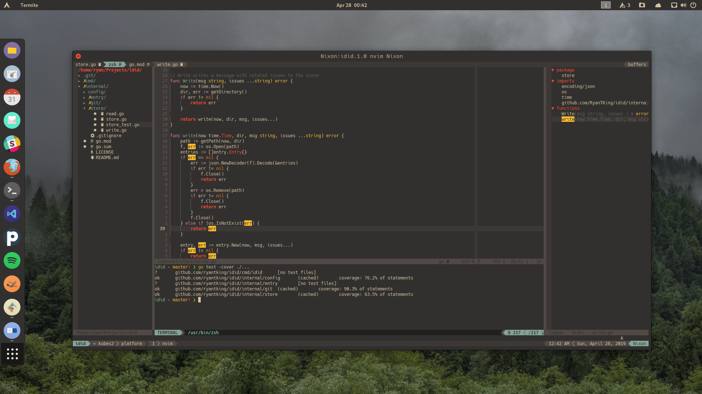

# .dotfiles

My configurations for various text editors and other utilties that I use on my macOS and Linux development machines.

## Editors

- [neovim](https://neovim.io/) as my day-to-day editor
- [spacemacs](http://spacemacs.org/) for Common Lisp development
- [Visual Studio Code](https://code.visualstudio.com/) for debugging and pair coding

## Other Tools

- [zshell](http://zsh.sourceforge.net/) as my bash replacement
- [git](https://git-scm.com/) setup with separate SSH and GPG keys for personal and work development
- [tmux](https://github.com/tmux/tmux) as my terminal multiplexer
- [iTerm](https://www.iterm2.com/) as my macOS terminal emulator
- [termite](https://github.com/thestinger/termite) as my Linux terminal emulator
- [chunkwm](https://koekeishiya.github.io/chunkwm/) as my macOS tiling window manager
- [i3](https://i3wm.org/) as my Linux tiling window manager

